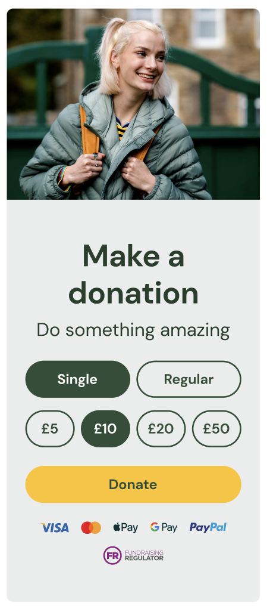
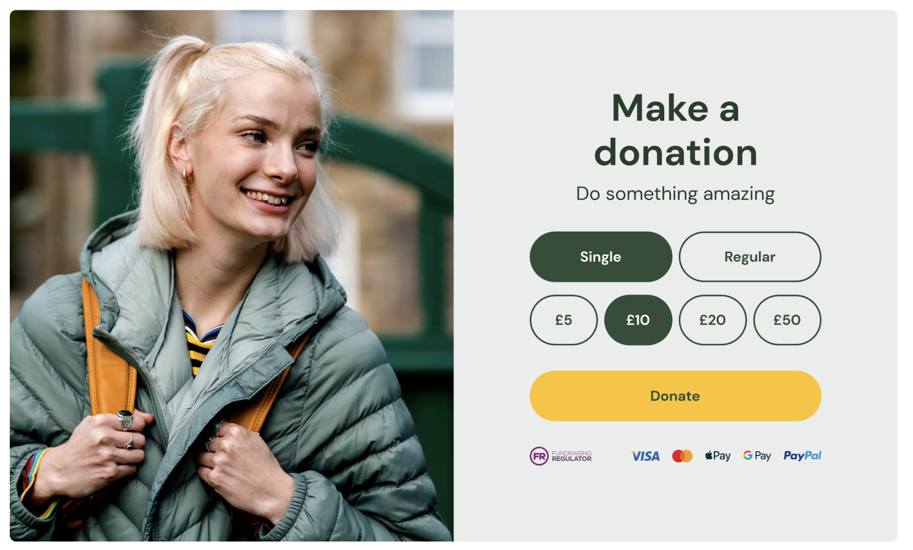

# Frontend code test

Please recreate the supplied designs in the following Figma document as a responsive browser-based component.

## Figma
[Figma File](https://www.figma.com/file/DunSOdxhEBTbYsBwRCHMSP/Hatch-Donation-Component?type=design&node-id=0%3A1&mode=design&t=cZxC18vcHP0wZTg2-1)

## Mobile Design

## Desktop Design

## Task details
We understand that under normal circumstances you would receive more information about the design but in this case, we want to see your ability to translate a visual into code with great attention to detail.

Switching between Single and Regular giving should show different donation amounts.

The component comes in 2 variations.

There are no restrictions on the technologies, languages or frameworks used.

Use this repo as if you were working on a production site and completed work should be returned as a pull request.

All required assets, graphics and fonts are supplied.

Please feel free to ask as many questions as needed.

